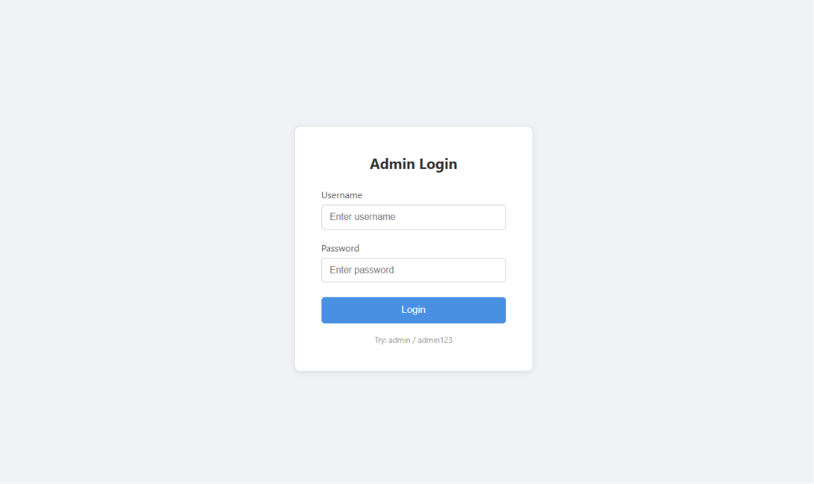
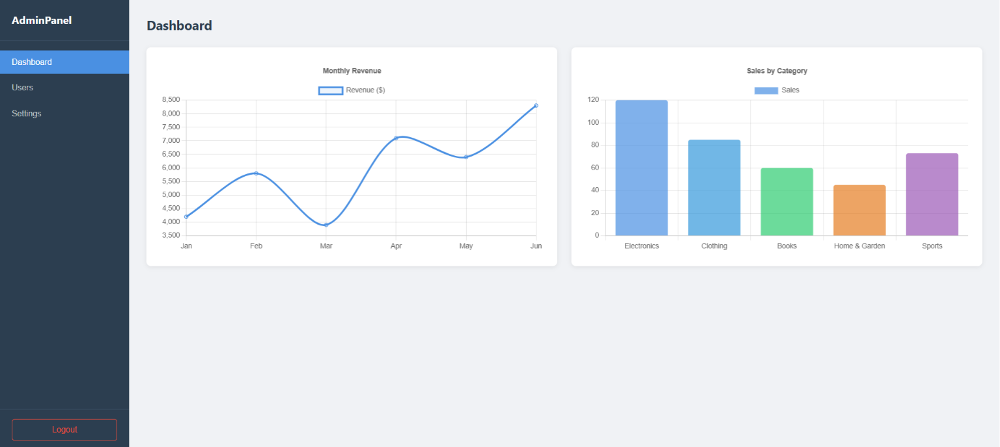
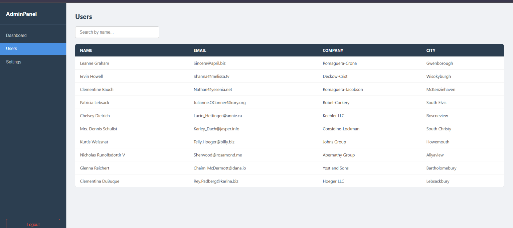
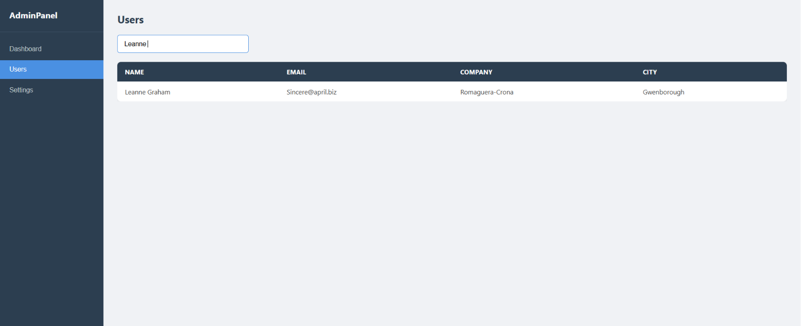
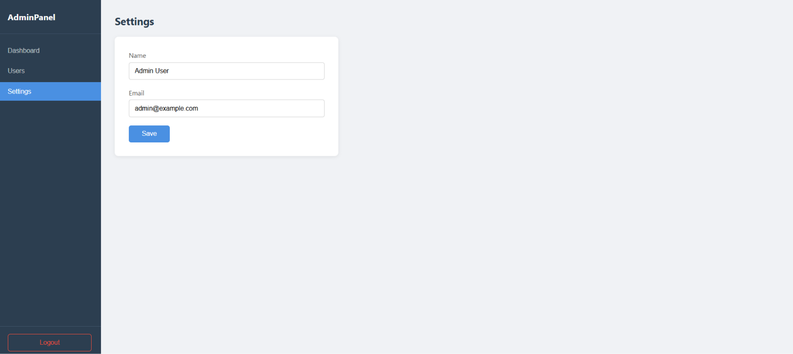

# Analytics Admin Dashboard

Live Demo: https://analytics-admin-dashboard-gold.vercel.app/

## Screenshots







## About This Project

A simple analytics admin dashboard I built as a portfolio project to practice React with Vite. It has a fake login screen, a dashboard with two charts, a users table that pulls real data from a public API, and a basic settings page. Nothing too fancy — just a clean single-page app showing off some core React concepts.

## Tech Stack

- React 18
- Vite
- Chart.js + react-chartjs-2
- JSONPlaceholder API (for fake user data)
- Plain CSS (no frameworks)

## Features

- Login screen with hardcoded credentials (admin / admin123)
- Sidebar navigation without React Router — uses a single `currentView` state variable
- Line chart showing monthly revenue (mock data)
- Bar chart showing sales by category (mock data)
- Users table fetched live from JSONPlaceholder API
- Live search / filter on the users table
- Settings form with a "Saved!" feedback message

## Challenges / What I Learned

Setting up Chart.js with React was a bit tricky at first — you have to manually register the chart components (`ChartJS.register(...)`) otherwise nothing renders, which wasn't immediately obvious from the docs.

The fake login was interesting to think about. There's no real backend, so the auth state is just a boolean in `useState` that resets on every page refresh. It felt a bit weird at first but makes total sense for a demo project — you don't always need a real backend to show a login flow.

The live search on the users table was simpler than I expected once I understood how `filter` works on arrays. I just lowercase both the search value and the user's name before comparing them so the search isn't case-sensitive.

## Run Locally

```bash
npm install
npm run dev
```

Then open http://localhost:5173 in your browser.
#
